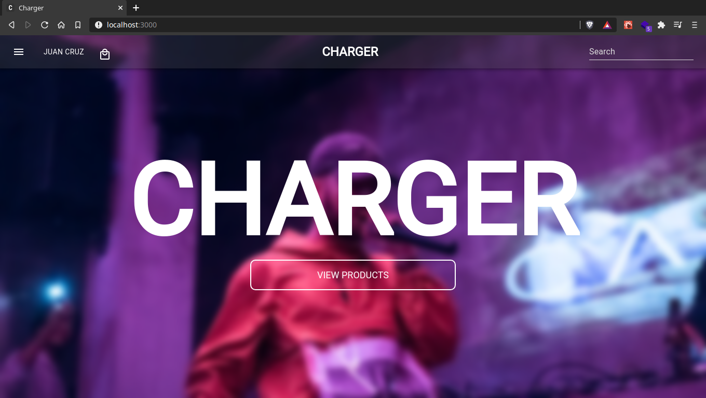
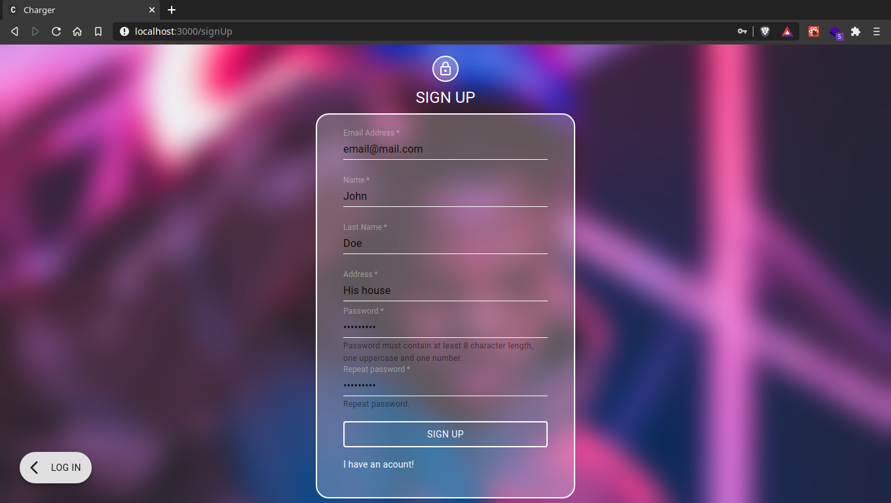
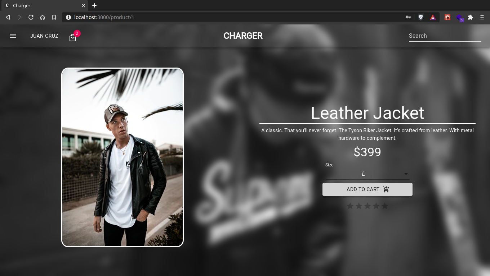
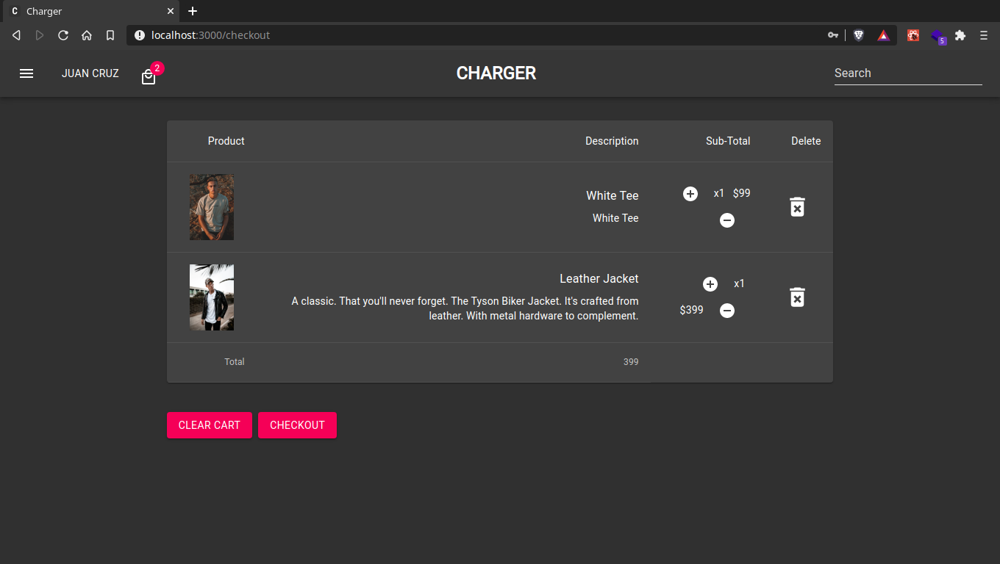
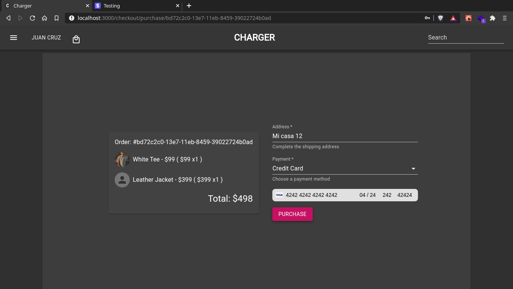
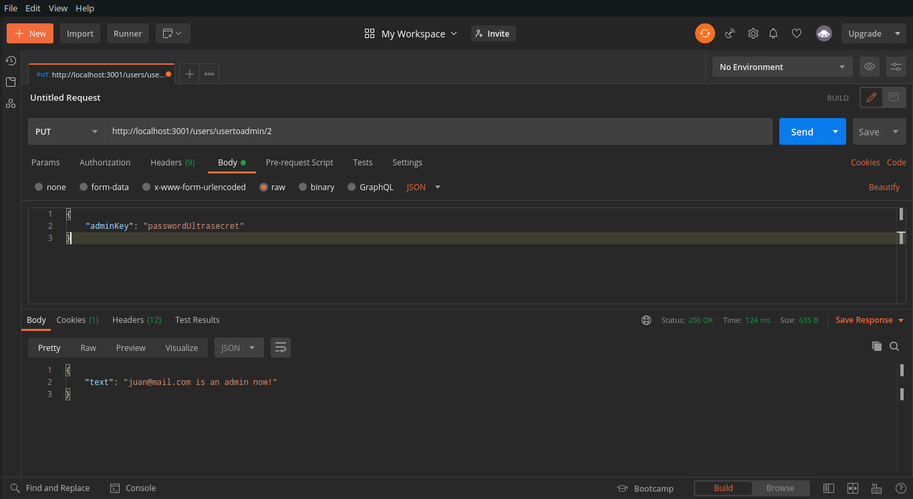
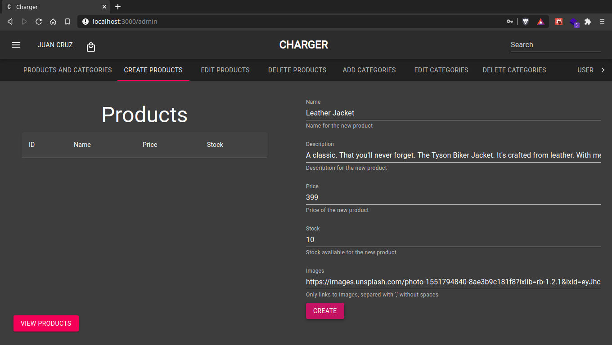
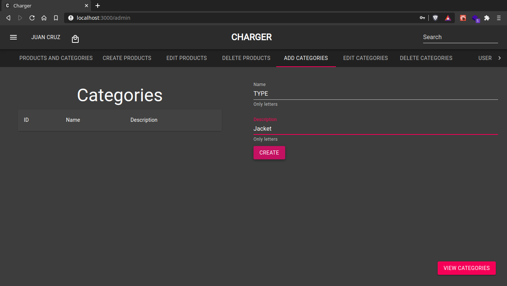
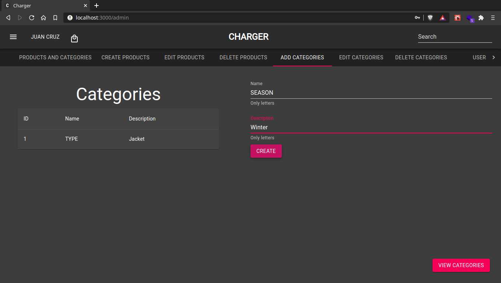
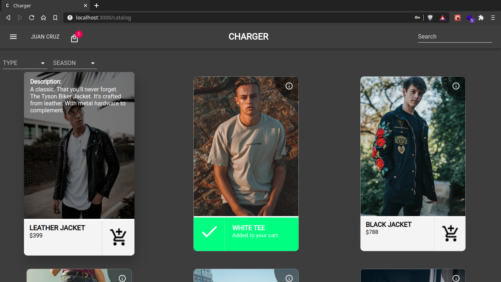

# CHARGER
Charger es un e-commerce dedicado a la venta de indumentaria. Fue desarrollado en la última etapa del Bootcamp [Soy Henry](https://soyhenry.com/) :rocket:

## HOMEPAGE :house:


## LOGIN & REGISTER :memo:




## PRODUCT PAGE :shirt: :jeans:


## CART :heavy_check_mark:
Se muestra un resumen de todos los productos agregados. A la vez se agregan un par de acciones para realizar, tales como:

- Agregar o eliminar productos del carrito
- Limpiar el carrito
- Generar la orden que lleva al pago.



## PAYMENT :credit_card:
En la sección del pago se muestra un resumen con los mejores datos indispensables. Para realizar el pago, implementamos [Stripe](https://stripe.com/), una librería de métodos de pago.

- Si deseas probar esta función, podes usar la siguiente información: 
  - Número: 4242 4242 4242 4242
  - Fecha: 04/24
  - CVV: 242
  - Ultimos digitos: 42424



## FEATURES :rocket:
Existen muchas más features implementadas, solo es cuestión de averiguar cuales son. Te invito a que puedas probar el proyecto :point_down:

## ¿Como correr el proyecto?
1. Crea una cuenta en [Mailgun](https://www.mailgun.com)
2. Buscar la Private Key y el dominio del email. *Más abajo hay un ejemplo de como deberían ser*
3. Crea una base de datos en PostgreSQL con un nombre a eleccion. En este ejemplo le pondremos "development". Se crea con el siguiente comando: `CREATE DATABASE development;`
4. Crea un archivo dentro de la carpeta "api" llamado `.env` con el siguiente contenido:
```
DB_NAME=development
DB_HOST=localhost
DB_USER=usuariopostgres
DB_PASSWORD=TuContraseña12345
EMAIL_DOMAIN=sandbox(seriedenumerosyletras).mailgun.org
EMAIL_API_KEY=privatekeydemailgun
ADMIN_KEY=passwordUltrasecret
```
5. Posicionate en la carpeta `api` y ejecuta el comando `npm install`
6. Posicionate en la carpeta `client` y ejecuta el comando `npm install`
7. Correr los servers
8. Abrí dos consolas
9. En una consola posicionate en la carpeta `api` y ejecuta el comando `npm start`
10. En la otra consola, posicionate en la carpeta `client` y ejecuta el comando `npm start`

## ¿Como puedo ser admin?
Al entrar a la página, verás que no hay ningun producto cargado. Para poder tener productos, tenemos que crear un usario administrador, a través de los siguientes pasos podemos lograrlo sin ningun inconveniente:

1. Nos posicionamos en el HOME PAGE
2. Damos click en la parte de LOGIN (*barra de navegación*)
3. Nos registramos en Charger con los datos que querramos, no se valida si es un email válido o no
4. Una vez registrados, iniciamos sesion en la cuenta.
5. Para poder setear un administrador necesitamos hacerlo a través de una URL con [Postman](https://www.postman.com/)

### Pasos en Postman

1. Abrimos Postman
2. Abrimos una nueva petición con el método PUT
3. Colocamos la URL *http://localhost:3001/users/usertoadmin/1*
4. Dentro de la opción Body, seleccionamos la opción "raw". Mas a la derecha hay una opción para elegir el estilo del texto, ponemos JSO
5. Luego colocamos el siguiente texto en el campo:
```
{
    "adminKey": "passwordUltrasecret"
}
```
5. Solo queda darle Send para que nuestro usuario ahora tenga permisos de administrador y refrescar la página.
   
6. Debería quedar algo así :point_down:
  


## ¿Qué puedo hacer como administrador? ¿Cómo lo hago?
Siendo administradores tenemos acceso a muchas funcionalidades de la página, tal como agregar/modificar/eliminar productos, hasta ver todos los usuarios registrados.

### Cargar productos y categorías
  1. Nos dirigimos al menu hamburguesa de la barra de navegación
  2. Hacemos click en la sección de ADMIN, se nos va a abrir una sección especial que contiene:
  ```
  Una barra de navegación: Acá tenemos acceso a todas las funcionalidades del Administrador
  Sección: Cada sección contiene las funcionalidades correspondientes a su nombre
  ```
  3. Vamos a la sección CREATE PRODUCTS
  4. Llenamos el formulario con los datos que nos pide:
  ```
  Name: Nombre de nuestro producto, ej: Leather Jacket

  Description: Un par de oraciones referido al producto

  Price: Precio del producto, ej: 399. (no acepta numeros de punto flotante, ej  9.99) 

  Stock: Cantidad de productos disponibles, ej: 12

  Images: Link de una imagen, por ejemplo: "https://images.unsplash.com/photo-1542838686-37da4a9fd1b3?ixlib=rb-1.2.1&auto=format&fit=crop&w=334&q=80"
  ```
  

  5. Solo queda darle al botón CREATE! Y listo, nuestro producto se ha creado.
   
  - En la carpeta ReadmeAssets te dejamos un archivo `.txt` con imagenes y descripciones de productos, para que puedas agregar varios productos.

  6. Ahora vamos a cargar dos categorías y asignarselas a nuestro producto
   
  7. Necesitamos ir a la sección ADD CATEGORIES
   
  8. Llenamos los dos campos con la siguiente información:
   ```
   Name: TYPE 
   Description: Jacket
   ```
  9.  Le damos a CREATE
   
  10. Creamos otra categoría
  ```
   Name: SEASON
   Description: Winter
  ```
  
  
  11. Ahora nos toca hacer que esas dos categorías que creamos, sean parte del producto. </br>
   
  12. Vamos a la seccion PRODUCTS AND CATEGORIES</br>

  13. Vamos a ver que nuestros productos y categorías creadas</br>

  14. Para setear las categorías tenemos que darle al botón SET CATEGORIES</br>
   
  15. Ponemos el ID de nuestro producto y el ID de la categoría que queremos usar.</br>

  16. Damos a SEND, y listo, ahora nuestro producto tiene Categorías seteadas!

  17. Ahora solo repetimos el proceso creando varios productos y categorías, asi vamos llenando nuestro Catálogo! Puede quedar algo así :point_down:



## Tecnologias usadas

### Frontend
- React hooks
- Redux
- Material UI
- Axios

### Backend
- Nodejs
- Express
- Sequelize (PostgreSQL)
- Mailgun
- Passport

## Nosotros

Somos un grupo de 5 estudiantes de [Soy Henry](https://www.soyhenry.com/). Estas son nuestras cuentas de GitHub:

- [Juan Cruz Lescano](https://github.com/JuanCruzLescano)
- [Juan Pablo Martinez](https://github.com/Jotap29)
- [Mauricio Nicolas Cruz](https://github.com/maunicols)
- [Federico Leiva](https://github.com/FedericoLeiva12)
- [Manuel Beleño](https://github.com/msebass1)
